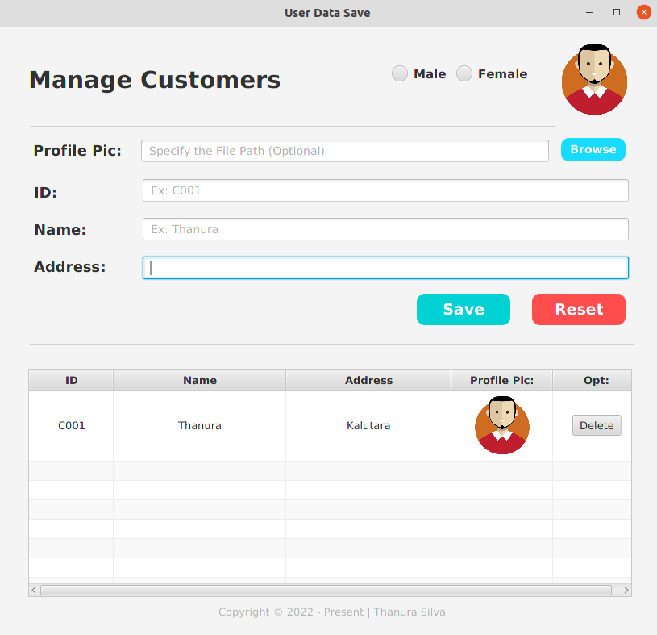

# Introduction and the Objective

This application is created with implement the Serialization process of the Java programming language.  
The user inputs data of the interface stored at a predefined file in the permanent computer memory (in the installed HDD or SSD) with a  given extension as .dep8. 
Stored data can be updated through the app and saved again and again.

;

The main objective of this application development is to enhance the existing hands-on skills of the Java programming language with the JavaFX library.
Especially here focused and practically pointed to the Serialization process of the Java programming language

# Licensing

This application is licensed as an [MIT](./License.txt) License. Copyright © 2022 – Present | Thanura Silva
